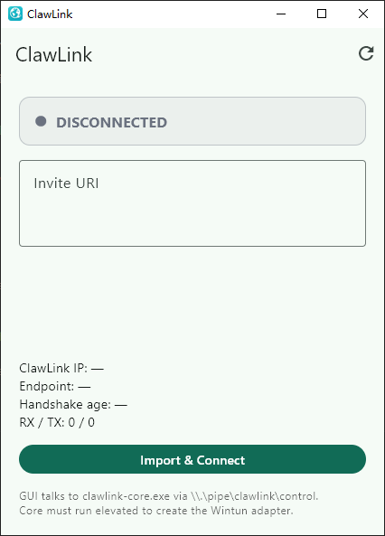
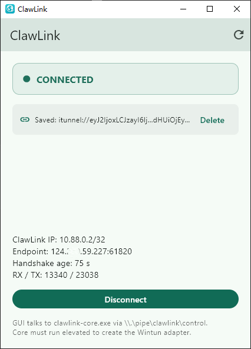

# ClawLink
Note!!! Winodws need version is win10+ and later.

Windows tray client for ClawLink / itunnel. The Flutter UI (`clawlink.exe`) talks to an elevated tunnel host (`clawlink-core.exe`) over a named pipe.

| Binary | Role | Privilege |
|--------|------|-----------|
| `clawlink.exe` | Flutter tray UI | normal user |
| `libs/clawlink-core.exe` | Tunnel host | Administrator |
| `libs/wintun.dll` | Wintun TUN driver helper | loaded by core |

Control pipe: `\\.\pipe\clawlink\control`

## Runtime

<table>
  <tr>
    <td align="center" width="50%">
      <br/>
      <sub>1. On startup</sub>
    </td>
    <td align="center" width="50%">
      <br/>
      <sub>2. When connected</sub>
    </td>
  </tr>
</table>

## Layout

```
libs/
  clawlink-core.exe   # required; ship with the app
  wintun.dll          # amd64 from https://www.wintun.net/
lib/                  # Dart sources (Flutter)
assets/
windows/
```

Native runtime deps live in **`libs/`** (not Flutter’s Dart `lib/`).

## Prerequisites

- [Flutter](https://docs.flutter.dev/get-started/install/windows) (Windows desktop enabled)
- Visual Studio with “Desktop development with C++”

## Build

```powershell
flutter pub get
flutter build windows --release
```

The Windows install step copies `libs/clawlink-core.exe` and `libs/wintun.dll` next to the built exe:

`build\windows\x64\runner\Release\libs\`

Or use the helper script:

```powershell
.\build.ps1
```

Artifacts are also mirrored under `output\`.

## Run

1. Start `clawlink.exe`.
2. Paste an `itunnel://` invite and click **Connect**.
3. Approve the UAC prompt so `clawlink-core.exe` can start elevated.

## Updating core / wintun

Replace files under `libs/` then rebuild (or copy into `Release\libs\` for a quick test).

`clawlink-core.exe` is produced from the ClawLink engine repo (`cmd/clawlink-core`, build with `-ldflags "-H windowsgui"`).
